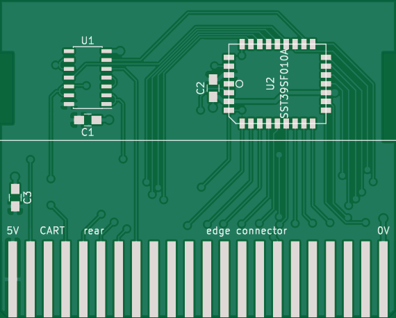
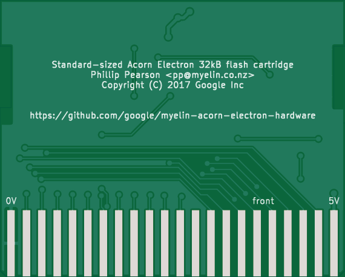
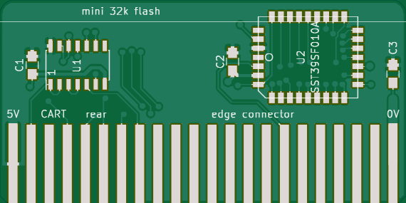
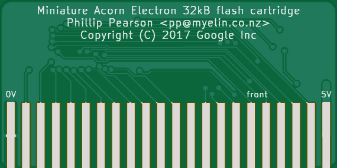

32kb_flash_cartridge
====================

This is a simple Acorn Electron cartridge that provides two 16kB flash
banks using a cheap 128kB SST39SF010A flash chip and a 74HCT00 quad
NAND gate.

I've made various different PCBs for this:

- original version (unreleased): this was based on [Paul Boddie's
  Electron breakout
  cartridge](http://hgweb.boddie.org.uk/AcornElectronCartridge).  This
  was my first PCB design for the Electron, and aside from one logic
  error (fixed by drilling out a track and adding a jumper wire) it
  works perfectly.

- [pcb-standard](pcb-standard/): This is designed to match the form
  factor of the PCBs used by Acornsoft for its ROM software.  I've
  built and tested one of these, and it works perfectly with no
  modifications.

- [pcb-mini](pcb-mini/): This is designed to just barely protrude from
  the Plus 1 when plugged in.  Unfortunately I forgot to re-pour the
  power and ground planes before generating gerbers to send off to the
  fab, and several data lines are shorted to ground in the units that
  I have.

[Discussion on the Stardot forums](http://stardot.org.uk/forums/viewtopic.php?f=3&t=12730).

Standard PCB:

Mini PCB:

