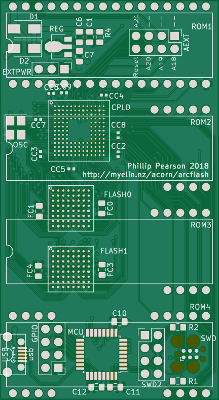
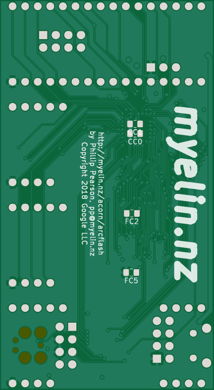

# Arcflash

A board that plugs into all Acorn Archimedes, A3000, A5000 (with adapter), and
Risc PC (with adapter) machines, allowing OS updates without opening the
machine -- or even powering it down!

[Stardot thread](https://stardot.org.uk/forums/viewtopic.php?f=16&t=16043)

Pictures
--------

Assembly notes
--------------

For IC sockets, cut two 40-pin headers to make:

- one 2x16-pin header and one 2x4-pin headers
- four 5+4-pin headers and two 2-pin headers

