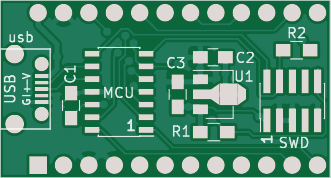
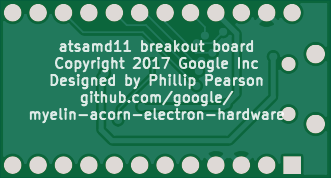

atsamd11_pro_micro
==================

Simple board consisting of an Atmel ATSAMD11C14 chip, a micro USB
socket, a voltage regulator, and an SWD header.

I'm excited about the potential of the tiny 14-pin ATAMD11C14 as a USB
interface for various other projects.  Its 16kB code space is a little
small, but it's tiny, costs just over a dollar, and has a crystal-less
USB device built in.  I expect it to work really well when I need a
quick USB interface for some CPLD based project, which is pretty much
all the time, and with any luck it should be able to double as a JTAG
programming interface.

As the name suggests, this board is intended to be a drop in replacement (in my
projects, at least) for the Sparkfun Pro Micro, which I use as a USB-SPI and
USB-JTAG interface for quite a few things.  As such, the pinout is a bit weird.

- Pin 11 = PA04 = nSD_SEL
- Pin 12 = PA05 = nSS  # sercom0.1
- Pin 14 = PA08 = MOSI / TDI  # sercom0.2  MATCHES
- Pin 15 = PA14 = MISO  # sercom0.0  MATCHES
- Pin 16 = PA09 = SCK / TMS  # sercom0.3  MATCHES
- Pin 17 = PA15 = TDO  # JTAG TDO
- Pin 18 = PA09 = SCK / TMS  # shared with Pin 16
- Pin 19 = PA02 = TCK  # JTAG TCK
- Pin 20 = PA08 = MOSI / TDI  # shared with Pin 14

JTAG is implemented using GPIO, because it has two output lines (TMS and TDI).
SERCOM0 is used for SPI.  Two pins are shared between both, and reconfigured
as appropriate.

Software support
----------------

It looks like [MattairTech's SAMD11 Arduino
port](https://github.com/mattairtech/ArduinoCore-samd/blob/master/variants/Generic_D11C14A/README.md)
should support this.

The bootloader I'm using is sam_ba_Generic_D11C14A_SAMD11C14A.bin, from [this
archive](https://www.mattairtech.com/software/arduino/SAM-BA-bootloaders-zero-mattairtech.zip),
programmed using my J-Link like this:

~~~~
JLinkExe -device atsamd11c14 -if swd -speed 4000
connect
erase
loadbin sam_ba_Generic_D11C14A_SAMD11C14A.bin, 0
r
go
q
~~~~

After this, the board enumerates as a MattairTech LLC Generic SAMD11C14A, and I
can program it using the Arduino IDE, using the CDC_HID, 4KB_BOOTLOADER,
INTERNAL_USB_CALIBRATED_OSCILLATOR, and NO_UART_ONE_WIRE_ONE_SPI options.

TODO: Make a Makefile like the one in third_party/usb_keyboard_forwarder, so I
can use the whole 16kB of code space.

Status
------

r1: Sent to oshpark.com for fabrication 2017-10-29.  Assembled and
tested, and appears to work.  Functions fine as a USB CDC device.

r2: Added SWCLK pullup, and extended the micro USB socket pads a
little to make them easier to solder.

