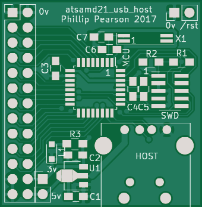
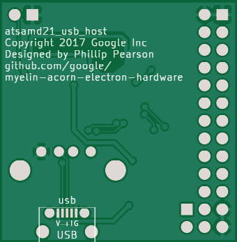

atsamd21_usb_host
==================

Simple board consisting of an Atmel ATSAMD21 chip, a USB-A socket (for USB host
operation), a micro USB socket (for USB device operation), a voltage regulator,
and an SWD header.

The ATSAMD21 is a cheap ($1-2) microcontroller that can act as a USB host, which
I plan to use to connect USB keyboards to my currently-keyboardless Master 128
and Beeb motherboards.

Software support
----------------

This works nicely with Atmel START, but that generates a *ton* of boilerplate
code, so I'm looking to see if I can use anything simpler, and hopefully
compatible with the code I'm writing for the Pro Micro.

I've successfully gotten it running using [MattairTech's SAMD21 Arduino
port](https://github.com/mattairtech/ArduinoCore-samd/tree/master/variants/MT_D21E_revB).

I can't use the bootloader for my project, because I want to have the USB port
in host mode.  Luckily Arduino has arduino-builder, which makes it easy to make
a Makefile.  This generates a .bin file, which I can write into the chip using a
J-Link script.

For a working example, see
[third_party/usb_keyboard_forwarder](../third_party/usb_keyboard_forwarder/).

Status
------

r1: Sent to oshpark.com for fabrication 2017-11-06.  Assembled and
tested; appears to work.  Functions fine as a USB CDC device, and as a host
for a mouse using code generated by Atmel START.

