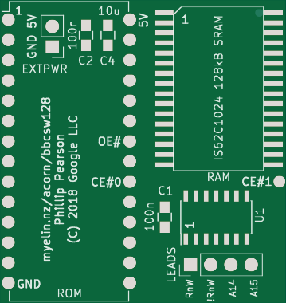
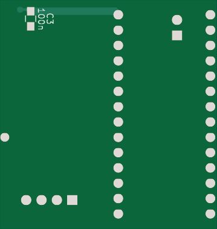

BBC 128kB Sideways RAM
======================

IN DEVELOPMENT -- UNFINISHED

This is a small board that plugs into two adjacent ROM sockets on a BBC Model B,
and provides 128kB (eight 16kB banks) of sideways RAM.

It gets power and almost all the signals it needs from one of the sockets, and
just needs to tap the chip select signal from the second socket.

Pictures
--------

Chip select logic
-----------------

Signals to the SRAM chip:

- A0-13 from the ROM socket
- /OE from a flying lead to nRDS
- /WE from a flying lead to nWDS
- A14 from a flying lead to IC76 pin 12 (BANKSEL[2])
- A15 from a flying lead to IC76 pin 11 (BANKSEL[3])
- A16 from /CS on one of the two ROM sockets
- /CE from a combination of /CS on both sockets

We want /CE to go low when either /CS0 or /CS1 goes low, i.e. /CE = /CS0 and
/CS1.  This can be achieved with a single AND gate.

We also have access to !2MHzE via the /OE pins on both ROM sockets.  We can
replace two long flying leads with one shorter one if we can produce nRDS and
nWDS from this.

- /OE = !2MHzE || !RnW = !(!!2MHzE && RnW)
- /WE = !2MHzE || RnW = !(!!2MHzE && !RnW)
- /CE = /CS0 && /CS1 = !!(/CS0 && /CS1)

Conveniently, the IS62C1024 RAM chip also has an active-high "CE2" line, so we
don't need to re-invert /CE:

- 2MHzE = not !2MHzE
- /OE = 2MHzE nand RnW
- !RnW = not RnW
- /WE = 2MHzE nand !RnW
- CE = /CS0 nand /CS1

We can do this in a single 74HCT00 chip by tapping both RnW and !RnW from IC33:

- !!2MHzE = not !2MHzE
- /OE = !!2MHzE nand RnW
- /WE = !!2MHzE nand !RnW
- CE = /CS0 nand /CS1
