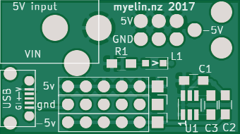
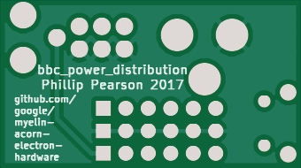

Simple power distribution and -5V generation board for running BBC
B/Master motherboards from a standard 5V PSU.

Built and tested against a BBC Master issue 1 motherboard.  It appears to run
fine, and the -5V output is looking good (the machine can load a game from the
cassette port).

