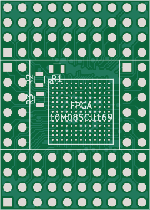
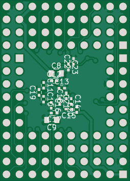

BGA in Two Layers
=================

http://myelin.nz/acorn/bgain2

An attempt to route a 10M04/10M08 BGA FPGA using only two copper layers.
Unfortunately also a test to see how little grounding I can get away with!
This should at least let me try to solder and bring up a 10M08 chip, and
hopefully the crosstalk at 2MHz won't be so bad.

Notes
-----

I'm using the free version of Intel's Quartus Prime software, programming in
VHDL.

To program the design into the chip, I generate an .svf file from the
Quartus Prime Programmer, then use OpenOCD and my J-Link or Bus
Blaster to download it.  See openocd.cfg for a working command set.

The 10m04_blink project (not checked in yet) just toggles all pins
between 0 and 1 at ~1Hz.

The [10m04_cpu_socket](10m04_cpu_socket/) project tries to do
something useful when attached to a cpu_socket_expansion board.  Join
the [thread on
Stardot](http://www.stardot.org.uk/forums/viewtopic.php?f=3&t=13253)
if you're trying to reproduce this, because it's a bit of a mess.

Status
------

PCB ordered at OSHPark 2017-12-28.

FIRST ASSEMBLY ATTEMPT -- I didn't initially order a stencil for the board,
and OSHPark uses an ENIG (gold plated as opposed to solder levelled) finish
for the board, so I tinned all the pads with a soldering iron, then drenched
it in flux with a flux pen, balanced the FPGA on top, and heated the whole
thing on a hot plate until it looked like it had reflowed.

Programming in a design that oscillated all pins between 0V and 3V3 at 1Hz
showed that six pins were either open circuit or intermitted contacts, and all
other pins appeared to have soldered properly.

I've ordered a stencil so I can try again with solder paste, because the whole
process was very fiddly. It took a lot of effort just to tin the pads; I'm not
sure if the board was dirty or small pads are just hard to work with, but the
last few were really hard to get to.  Next time I'm going to try cleaning the
board with IPA, applying solder paste, and reflowing.

I'm going to try using the first attempt board by setting all the bad pins as
high-Z, and bridging them over to known-good pins.  This is documented in
[first_attempt.pdf](first_attempt.pdf).

SECOND ASSEMBLY ATTEMPT -- This worked way better.  The first board
was super flaky, and I never managed to get all the address pins
working properly.  The second one appears to behave correctly.  I used
solder paste and a lower reflow temperature, and fitted a lot of
decoupling capacitors.

