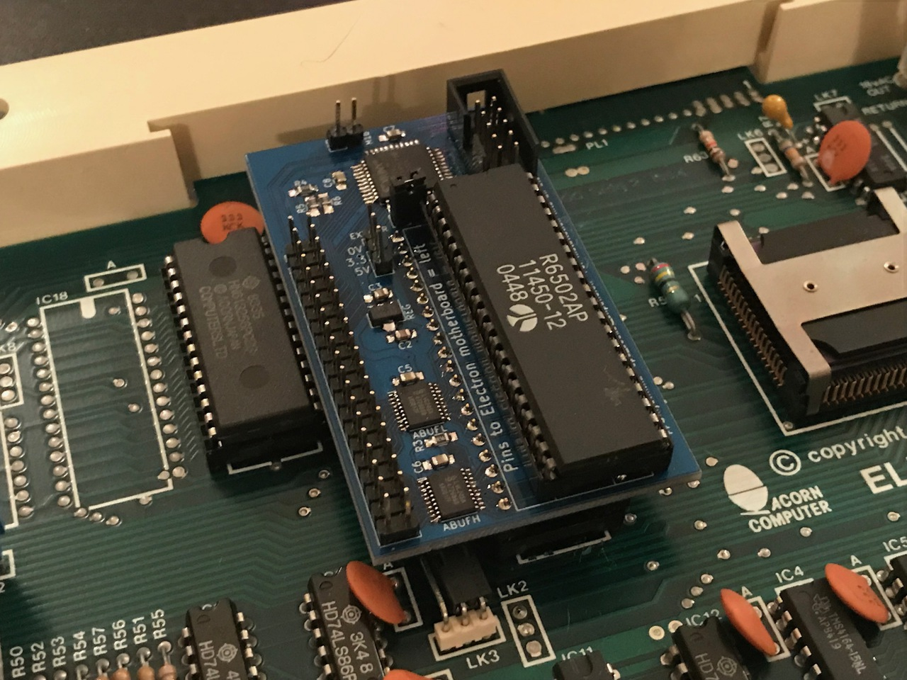
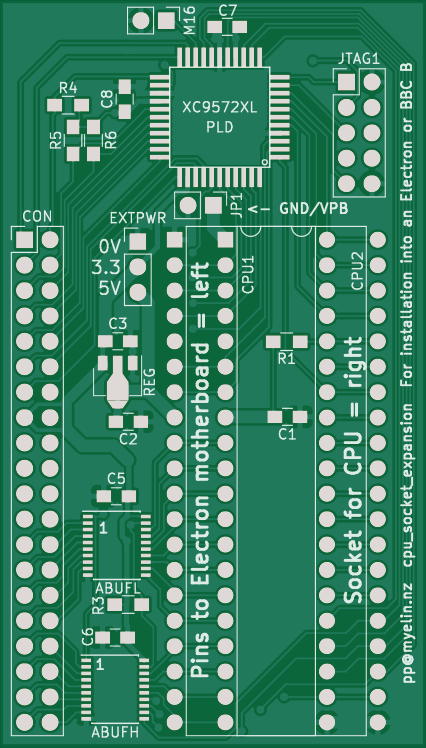

Board that intercepts signals from the Acorn Electron
or BBC Micro's 6502 CPU, and provides a very flexible interface into
the heart of the machine.  (Good enough to implement something like
the Slogger MRB, or to use a soft CPU in an FPGA, or to do a 3.3V
flash/RAM/IO board.)

I've assembled one of these and tried it out with no daughterboard
connected, in an Electron, with very basic HDL that just copies
A15:A13 from the CPU to the motherboard.  It boots fine, as expected.

I've also tried it out with the the miniSpartan + Pi Zero daughterboard, and the
OS ROM removed, and the XC6SLX25 implementing some sideways ROM and RAM.

[pcb/](pcb/) - PCB design

[cpld/](cpld/) - CPLD design, which assumes you have a 6502 in the top
socket (i.e. the address buffers are always pointed *away* from the
CPU).

Future plans
------------

Initial tests have been really promising, and I've realized that soft 6502 CPU
cores are very small, so I can implement them in small nonvolatile FPGAs like
the Lattice MachXO/MachXO2 series.

The next version of this board will not include a CPU socket, just a pair of
74LVC16245 buffers, to handle the soft 6502's address and data bus, as well as
all control inputs.

Pictures
--------

