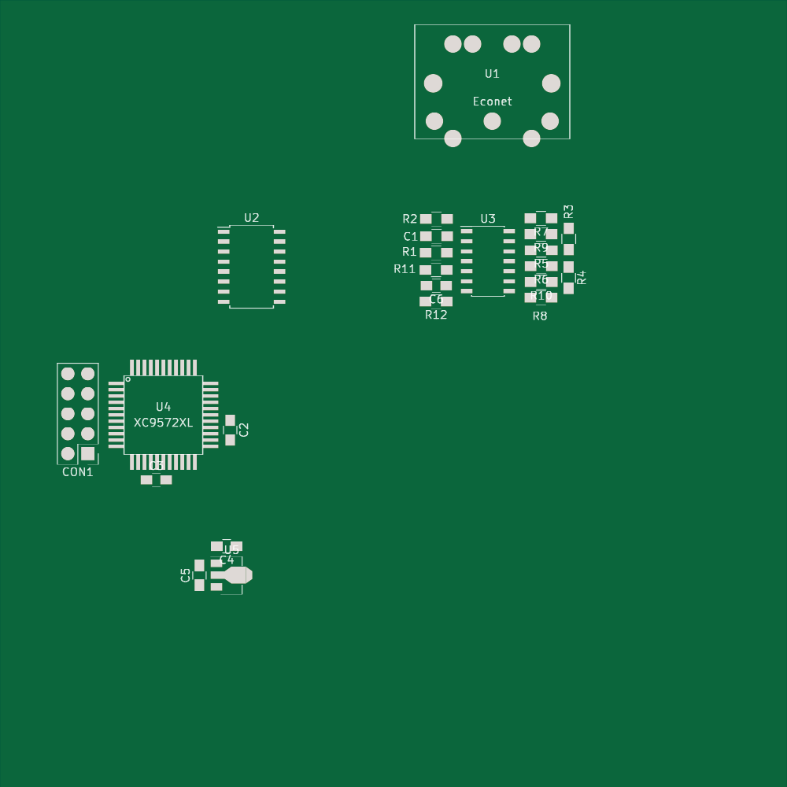
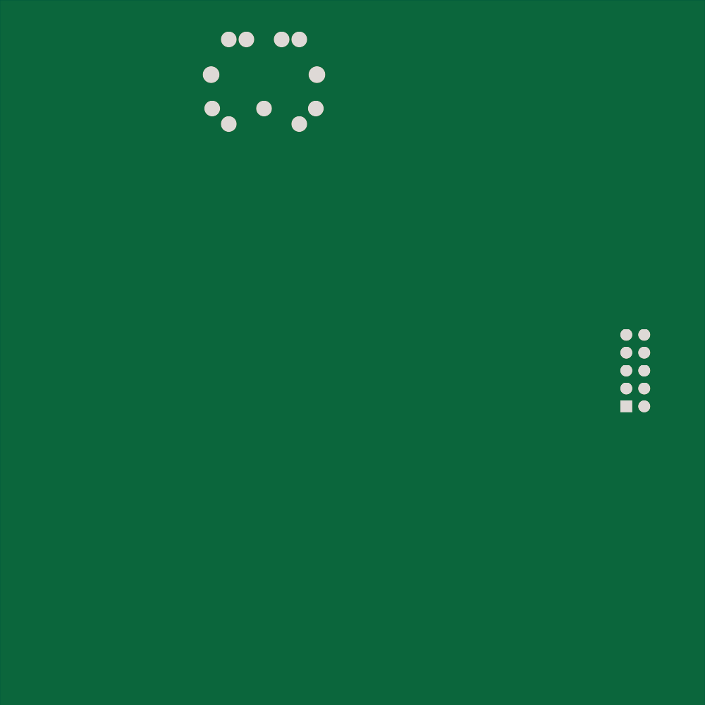

Econet from scratch
===================

http://myelin.nz/acorn/ecostd

Can we implement an Econet interface from scratch, without having to use a BBC
Master Econet module or MC68B54 chip?

I've built one of these, and am working on the RTL and firmware.

Design overview
---------------

This board will allow a computer with a USB port to communicate on an Econet
network. A CPLD handles the wire protocol and a microcontroller handles
framing and communicating with the attached computer.

Econet uses a "four way handshake", where a transmitting station sends out a
"scout frame" to the intended receiver, the receiver acknowledges the scout
frame if it has buffer space available and can receive a message, the
transmitter sends the message, and the receiver acknowledges the message.

There are also broadcast messages, which I believe are sent as scout frames
and don't expect any acknowledgement.  Presumably a station receiving a
broadcast may contact the broadcaster using the usual four way handshake.

Bringup
-------

Sampled serial output while connected to an A3000 during bootup:

- FLAG x 8
- FLAG FF FF 80 00 41 39 42 4E 96 26 E6 A6 39 00 7D FB FLAG

It looks like the bits are sent in reverse order on the line.  Reversing that gives:

	ff -> ff
	ff -> ff
	80 -> 01
	00 -> 00
	41 -> 82
	39 -> 9c
	42 -> 42
	4e -> 72
	96 -> 69
	26 -> 64
	e6 -> 67
	a6 -> 65
	39 -> 9c
	00 -> 00
	7d -> be
	fb -> df

This is what we expect, and the CRC is BEDF or 7DFB (or FB7D or DFBE).

https://www.lammertbies.nl/comm/info/crc-calculation.html gives 0x1D0F as the CRC-CCITT with 0xFFFF preset for the bytes on the line without bit reversal (FFFF80004139424E9626E6A639007DFB), which looks correct.

Calculating CRC for the reversed (fixed) bits, FFFF0100829C4272696467659C00BEDF, doesn't give anything useful.  The MC6854 datasheet says the CRC residue should be F0B8, which is 1D0F reversed.

    short_c = 0x00ff & (unsigned short) *ptr;
    tmp     = (crc >> 8) ^ short_c;
    crc     = (crc << 8) ^ crc_tabccitt[tmp];

Bytes read from the serial connection on boot:

7E 7E 7E 7E 7E 7E 7E FF FF 80 39 39 96 E6 39 39 FB FB 
         7E 7E 7E 7E 7E FF 80 41 42 96 96 A6  0 FB FB
expect:              FF FF 80 00 41 39 42 4E 96 26 E6 A6 39 00 7D FB FLAG
analyzer:    ... 17E FF FF 80 00 41 39 42 4E 96 26 E6 A6 39 00 7D FB 17E

so it looks like it's not making it back through the serial port so well.
"Data input on the RxD pin is sampled at the opposite XCK clock edge when data is driven on the TxD pin"
"When CTRLA.CPOL is '1', the data will be changed on the falling edge of XCK, and sampled on the rising
edge of XCK."
-- ATSAMD21 datasheet 26.6.2.3
This is correct.

Bytes read from the serial connection when connected to an an A3000 that's trying to connect to 0.254 (00 FE):
* 0 0 11 0 0 0 35 7E 
* 7F 0 0 0 0 0 53 7E 
* 7F 0 0 0 0 0 53 7E 7E 
[...]

And when connecting to 123.55 (7B.37)
* EC EC 0 0 0 0 34 34 DC 
* EC EC 0 0 0 0 0 DC DC 
* DE DE 11 11 0 0 34 
[...]

Saleae: 17E 7F 00 80 00 11 00 00 00 00 00 35 53 17E
(After fixing code to not throw out chars)
Bytes read from serial connection when trying to connect to 0.254:

* 17E 7F 80 11 0 0 0 0 53 
* 17E 7F 0 80 11 0 0 0 53 
* 17E 0 80 11 0 0 0 35 53

After buffering frame in code rather than dumping bytes one by one, I get lots of these:
* 7F 0 80 0 11 0 0 0 0 0 35 53 (appears bit-reversed)
* FE 00 01 00 88 00 00 00 00 00 AC CA

"FS List" command in RISC OS sends this:
* FF FF 80 0 1 99 80 70 0 0 0 0 20 0 6B 8D (appears bit-reversed)
* FF FF 01 00 80 99 01 0E 00 00 00 00 04 00 D6 B1
* FF FF 01 00 80 99 01 0E 00 00 00 00 04 00 D6 B1; CRC ACE7 (BAD)

On boot:
* FF FF 01 00 82 9C 42 72 69 64 67 65 9C 00 BE DF

Frame: FF FF 01 00 82 9C 42 72 69 64 67 65 9C 00 BE DF; CRC F0B8 (ok)
Frame: FE 00 01 00 88 00 00 00 00 00 AC CA; CRC F0B8 (ok)
Frame: FF FF 01 00 80 99 01 0E 00 00 00 00 04 00 D6 B1; CRC F0B8 (ok)

Econet wire protocol
--------------------

The Econet wire protocol is fairly simple.  A frame begins with the sequence
01111110, followed by the payload, two CRC bytes, and 01111110.  The MC6845
datasheet specifies a standard format for the payload, but it appears that this
is optional, as Econet frames don't appear to follow the rules.

It shouldn't be too hard to convert this into an asynchronous serial interface
running at a higher frequency, which a sufficiently fast microcontroller should
be able to drive safely.

The maximum clock rate for compatibility with 6502 systems is 250 kHz,
resulting in 31250 bytes per second, or one every 32 us.  Archimedes systems
can handle up to 660 kHz, or one byte every 12 us.  A CPLD could easily
convert this into an asynchronous serial stream, or feed it into an SPI-
accessible shift register.

The tiny ATSAMD11 and the very cheap ATSAMD21 both have DMA, so it should be
possible to output arbitrary sized messages without processor involvement,
ideally with the USRT. When using the USRT, the CPLD can drive the XCK pin,
stopping the clock when its buffer is full. Because Econet is a half-duplex
protocol, we should never need to transmit in both directions at once, so an
interface like this should work well:

- Econet transceiver->CPLD: clock (R, D, DE)
- Econet transceiver<->CPLD: data (R, D, DE)
- Econet transceiver->CPLD: collision detect
- MCU->CPLD: 8MHz clock (or similar)
- MCU->CPLD: Econet clock signal (if we want to act as a clock)
- MCU->CPLD: data direction
- CPLD->MCU: XCK (stopped when the CPLD's buffers are full)
- MCU->CPLD: TXD (data to transmit to Econet)
- CPLD->MCU: RXD (data received from Econet)

As long as XCK runs faster than the Econet clock, there will never be a buffer
overrun or underrun anywhere.

Alternative transceiver chip
----------------------------

The SN65C1168/SN75C1168 is cheap and can handle both the data and clock lines.
(Not to be confused with the SN65/75C1167, which ties the driver enable line for
both outputs together, and won't work for Econet).  The SN65- parts have a wider
temperature range but are otherwise identical to the SN75- parts.

I'm using the SN65C1168NS (SOIC) for convenience ($1.61 from Digikey).

Collision detection
-------------------

There's a standard BBC circuit for collision detection, used on the
Model B and on the Master Econet module; it works by finding the
average of the D+ and D- lines, adding about 0.125V, and signalling a
collision if neither line is above the average.  In a collision
situation, two drivers on different stations are fighting each other,
which probably results in D+ and D- both being pulled down near 0V, as
the high side of the SN95159 output has a 9 ohm series resistor.

It's possible that this isn't necessary, because the CPLD can just
compare what comes back from the receive side and flag a collision if
it doesn't match what's being transmitted.  I'm putting the standard
collision-detect circuit on the board, just in case.

BBC Master interface
--------------------

The Econet module has a 17-pin interface (PL1) to the host machine (SK5):

- 1 /NETINT
- 2 RnW
- 3 /ADLC
- 4 PHI2
- 5 A0
- 6 A1
- 7 D0
- 8 D1
- 9 D2
- 10 D3
- 11 D4
- 12 D5
- 13 D6
- 14 D7
- 15 /RST
- 16 0V
- 17 5V

Two extra pins, A and B, bring out A2 and A3 respectively, although are not
present on the Econet module board.

There are 15 data pins: 7 are inputs to the module, and 8 are bidirectional,
so two 74LVC245 chips or one XC9536XL CPLD would handle the level shifting.

Physically, the module measures 94x58mm, with 44mm
between the vertical centre of PL2 (which connects to the Econet socket) and PL1
(which connects to the bus).  PL2 starts 9.5mm from the right edge of the board,
and PL1 starts 4.5mm in.  PL2 pin 5 is vertically in line with PL1 pin 15.

PL1's 17 pins cover 40.5mm, so they appear to be spaced at 0.1".

The MC68B54 has four 8-bit control registers, two status registers, and two
3-byte FIFOs, for a total of 96 bits of RAM, plus probably a few shift
registers.  This suggests that with an LCMXO256 chip (with 2048 bits of RAM) we
could possibly expand the FIFOs a bit.

Alternatively this might work with a small but fast MCU like the ATSAMD11C; one
or two USRTs running at 24 MHz would allow queuing to happen in the MCU's RAM
rather than the CPLD.

BBC B interface
---------------

Would it be possible to hook up to the BBC B as well?  All the pins from PL1 on
the module go to the ADLC (68B54) chip.  The Econet data pins connect to pins
12/13 on IC93 (SN75159), and the clock pins connect to R38 and R39.  Fitting 0R
links in R38 and R39 would bring the clock signals to pins 9/10 on IC94 (LM319).
So it would be fairly feasible to create an adapter to fit an Econet module to a
BBC B.
