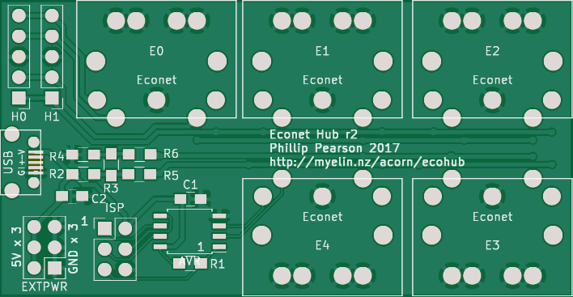
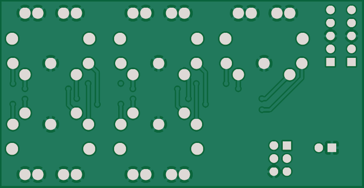

Econet hub
==========

http://myelin.nz/acorn/ecohub

A simple board that provides an Econet clock and biasing, and a bunch
of Econet sockets.

Status and history
------------------

I haven't tested this, but [https://stardot.org.uk/forums/viewtopic.php?f=3&t=15049](lcww1 on Stardot has), and it looks like they work well.

Revision 1 had a bug with the ATTINY85 footprint; it was too narrow,
so to solder the chip on, I had to turn it into a J-lead package by
bending its legs underneath.

