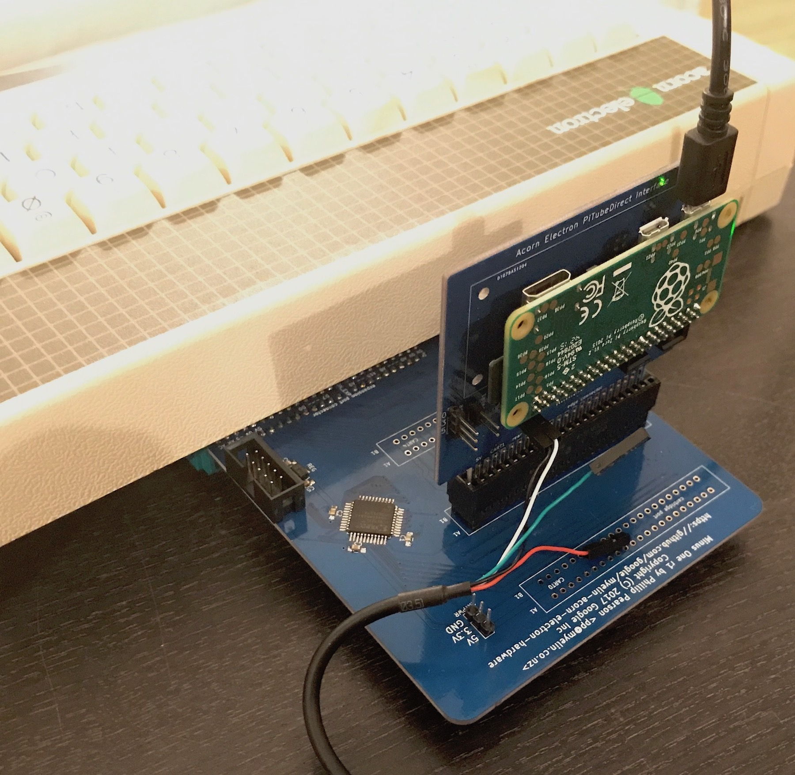
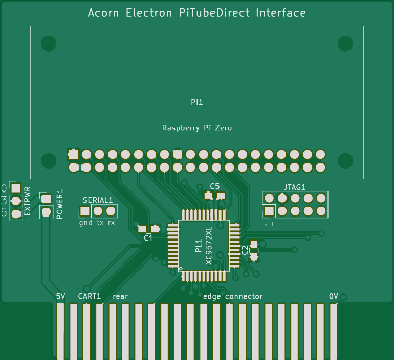
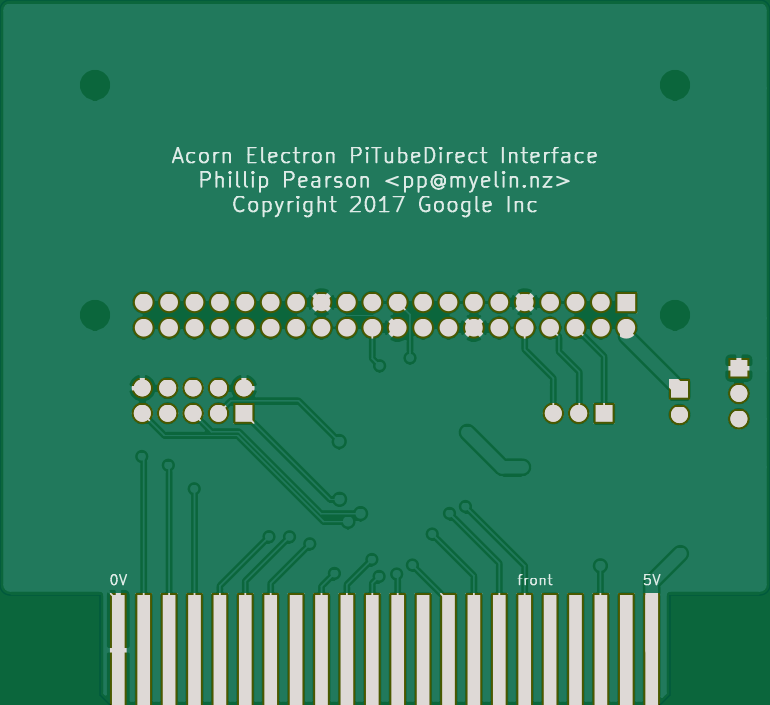

Elk PiTubeDirect
================

This is an Electron cartridge that implements the address decoding and
level shifting required to interface with a Raspberry Pi running
[PiTubeDirect](https://github.com/hoglet67/PiTubeDirect).

I've built one of these and verified that it works!  It needs a ROM
installed containing the Tube Host code (I use
[MMFS](https://github.com/hoglet67/MMFS), flashed into one of my
[32kb_flash_cartridge](../32kb_flash_cartridge/) standard boards), otherwise the interface
shows up in the Electron's memory (&FCE*) but doesn't do anything.

[Discussion on the Stardot forums](http://stardot.org.uk/forums/viewtopic.php?f=3&t=11325&start=720#p166961).

