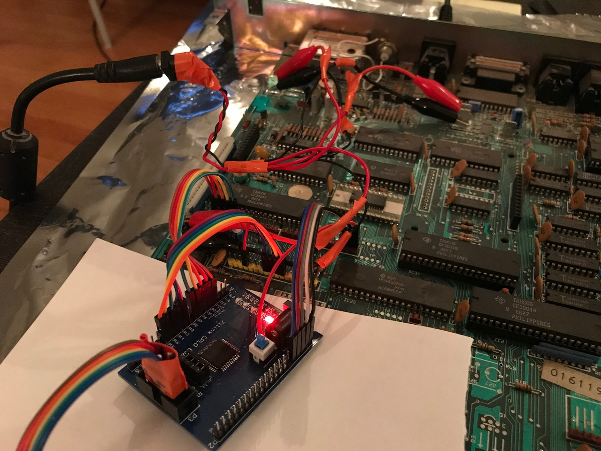

emulated_keyboard
=================

This uses pygame, a Pro Micro, and a CPLD to allow you to use your computer as a
keyboard for a BBC Master 128.

See: http://www.stardot.org.uk/forums/viewtopic.php?f=3&t=13804

Usage
-----

- Program an XC9572XL with the code in prototype_cpld/
- Program a Pro Micro with the code in prototype_firmware/
- Run prototype_keyboard_sender.py on your computer (only tested on a MacBook Pro, so YMMV with anything else)

Wiring
------

- The CPLD needs to be connected to PL11, PL24, and PL7 on the Master 128 motherboard.  PL7 is probably not populated, so you'll have to solder a header in there.  See new_master_bringup/README.md for the pinout, and see cpld/constraints.ucf for how the pins connect to the CPLD.
- The CPLD needs to be connected to the Pro Micro's SPI port.  Pinout in new_master_bringup/README.md.
- The Pro Micro should be connected to your computer's USB port before running listen_pygame.py.

Future plans
------------

- Make a board with an ATSAMD21 USB host, a MachXO CPLD, and a buffer chip, to allow connecting a USB keyboard straight to the Master 128.
- Maybe make the board compatible with the Beeb and Electron too.
- Make a whole new keyboard from scratch, with something like this project on board, or with a USB device chip to give it a USB interface, that connects to the ATSAMD21 board.

Keyboard connector details
==========================

Master 128 keyboard connector
-----------------------------

The columns are normally open circuit, and the rows are pulled up to 5V.
SHIFT LOCK, CAPS LOCK, and POWER LED are pulled to 5V via 330R resistors.
KBD SW is connected to the reset line, so it normally sits at 5V.

Interface for initial version, using an XC9572XL CPLD:
- /KBEN input
- 4-bit column input, taken from PL7
- 8-bit row output
- KBD SW (/RESET) output (open collector)

Minimal interface hardware to 3.3V with a MachXO256 FPGA:
- Open collector drivers for R0-7 and KBD SW (3 x 74HCT125, using 9/12 outputs)
- 5V tolerant input for 4-bit column value from PL7, pulled up input for SHIFT
  LOCK, CAPS LOCK, and POWER LED (3 x resistor, 1 x 74LVC245 using 7/8 inputs)

Interface hardware to 3.3V with a MachXO256 FPGA, without adding pins to the Master motherboard:
- 10 I/O lines with pullups to 3V3 (internal to FPGA), connected to the columns
- Open collector drivers for R0-7 and KBD SW (3 x 74HCT125, using 9/12 outputs)
- Pullups for SHIFT LOCK, CAPS LOCK, and POWER LED, with 5V tolerant input
  (3 x resistor, 1 x 74LVC245)
(10 direct IOs, 9 OC drivers, 3 pulled-up inputs)

PL11
- 1 - C6
- 2 - BAT
- 3 - R0
- 4 - R6
- 5 - R7
- 6 - R2
- 7 - R1
- 8 - C11
- 9 - C10
- 10 - C12
- 11 - C0
- 12 - C2
- 13 - C9
- 14 - C4
- 15 - C5

PL24
- 1 - C8
- 2 - C7
- 3 - C3
- 4 - C1
- 5 - R5
- 6 - R4
- 7 - R3
- 8 - C (diode to C1) -- CTRL key
- 9 - SHIFT LOCK LED (330R to IC10 pin 7)
- 10 - CAPS LOCK LED (330R to IC10 pin 6)
- 11 - POWER LED (330R to 5V)
- 12 - S (diode to C0) -- SHIFT key
- 13 - KBD SW (BREAK: GND when BREAK pressed, open circuit normally)
- 14 - GND
- 15 - 5V

BBC B keyboard connector
------------------------

CA2 is an output to the system VIA, and D* are inputs and outputs.  1MHZE is
the system clock.

Minimal interface hardware to 3.3V:
- 5V tolerant inputs for 7 D lines, /KBEN, three LED lines with pullups
  (2 x 74LVC245 using 11/16 inputs, 3 x resistor)
- OC driver for KBD SW (BREAK) and CMOS drivers for D7 and CA2 (1 x 74HCT125, using 3/4 outputs)
- Ignore 1MHZE
(8 5V inputs, 3 pulled-up IOs, 3 drivers)

PL13
- 1 - GND
- 2 - KBD SW (OC output, pulled up to 5V by BBC)
- 3 - 1MHZE (input from BBC)
- 4 - /KBEN (input from BBC)
- 5 - D4 (input from BBC)
- 6 - D5 (input from BBC)
- 7 - D6 (input from BBC)
- 8 - D0 (input from BBC)
- 9 - D1 (input from BBC)
- 10 - D2 (input from BBC)
- 11 - D3 (input from BBC)
- 12 - D7 (TTL output from keyboard)
- 13 - CASSETTE LED (OC input from BBC)
- 14 - CA2 (TTL output from keyboard)
- 15 - 5V
- 16 - SHIFT LOCK LED (OC input from BBC)
- 17 - CAPS LOCK LED (OC input from BBC)

Electron keyboard connector
---------------------------

A* are the CPU's address lines, and D* are inputs to the ULA, pulled up to 5V
on the keyboard PCB.
BREAK is the CPU /RESET line, and CAPS LOCK is an LED driver, that is pulled
down when active.

Minimal interface hardware to 3.3V:
- 5V tolerant input for 14 A lines and CAPS LOCK (2 x 74LVC245 using 15/16 inputs, 1 x resistor)
- CMOS drivers for D0-3 and open collector driver for BREAK (2 x 74HCT125 using 5/8 outputs)
(14 5V inputs, 1 pulled up input, 5 CMOS drivers)

PL2
- 1 - BREAK
- 2 - CAPS LOCK
- 3 - GND
- 4 - 5V
- 5 - D0
- 6 - D1
- 7 - D2
- 8 - D3
- 9 - A13
- 10 - A12
- 11 - A11
- 12 - A10
- 13 - A9
- 14 - A8
- 15 - A7
- 16 - A6
- 17 - A5
- 18 - A0
- 19 - A1
- 20 - A2
- 21 - A3
- 22 - A4

Minimal hardware for 3.3V compatibility for all keyboards
---------------------------------------------------------

- Master: 10 direct IOs, 9 OC drivers, 3 pulled-up inputs, i.e. 9 CPLD IOs + 3 pulled-up IOs
- Beeb: 8 5V inputs, 3 pulled-up IOs, 3 drivers, i.e. 11 CPLD IOs + 3 pulled-up IOs
- Electron: 14 5V inputs, 1 pulled up input, 5 CMOS drivers, i.e. 19 CPLD IOs + 1 pulled-up IO, and four of the IOs are OK to put a pullup on, so this works out at 17 CPLD IOs + 3 pulled-up IOs

So our minimal configuration requires 20 CPLD pins, leaving 14 for communications with the FPGA.

TODO check that LEDs work the same on all three.  Master appears to pull to 5V.

- Master:   3-GGGGG33333333 3333GGG-PPP-G05
- Beeb:     0G-GGGGGGGGPG5PP
- Electron: GP05ggggGGGGGGGGGGGGGG

G = CPLD gpio
g = CPLD gpio, pullup ok
P = CPLD gpio, needs pullup
3 = FPGA gpio
0 = GND
5 = 5V
- = NC
