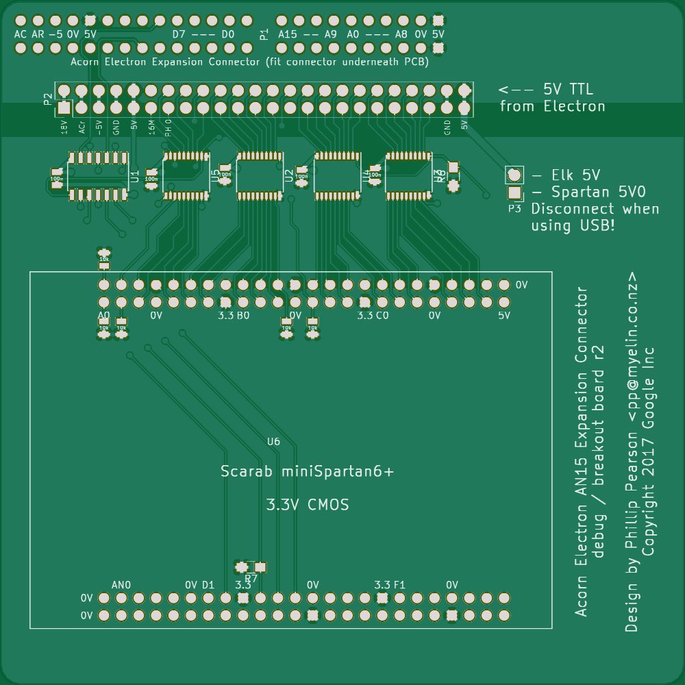
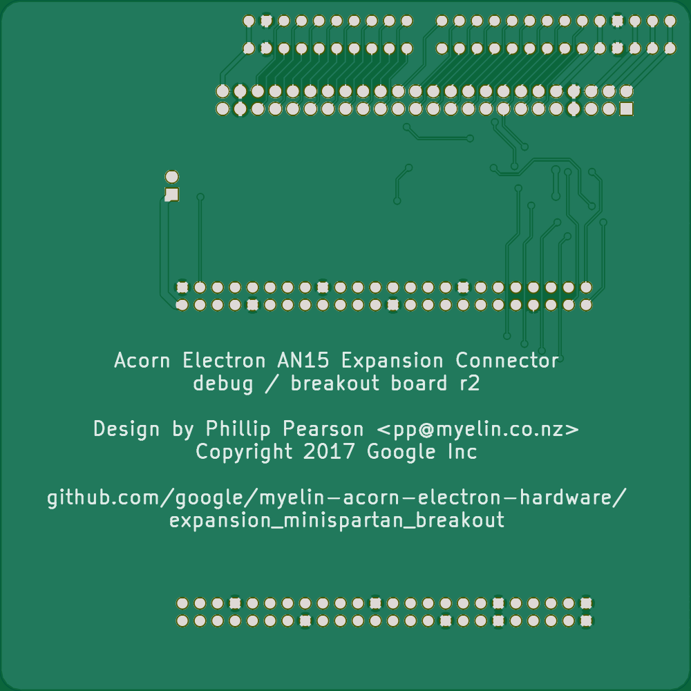

expansion_minispartan_breakout
==============================

_Superseded by [cpu_socket_expansion](../cpu_socket_expansion/) and
[cpu_socket_minispartan_daughterboard](../cpu_socket_minispartan_daughterboard/)._

This board breaks out the expansion connector to 0.1" holes, and
provides the necessary level conversion and buffering to allow a
Scarab miniSpartan6+ board to interface with the Electron's expansion
connector.

I've assembled and tested one rev 1 board, with the miniSpartan6+ configured to
provide a few ROM banks, and it works pretty nicely.  I made some changes for
rev 2 to allow switching the direction of the address buffers, which would make
it possible to use a soft CPU in the FPGA (after removing the CPU from the
Electron's motherboard).  I never made a rev 2 board, however, as at that point
I [acquired a BBC Micro](../new_bbc_bringup/) and started working on more
portable hardware.

