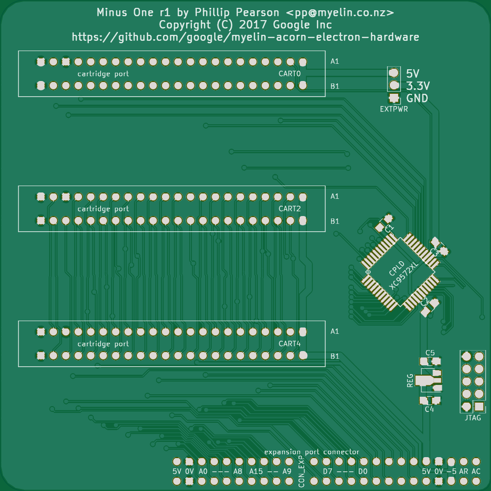
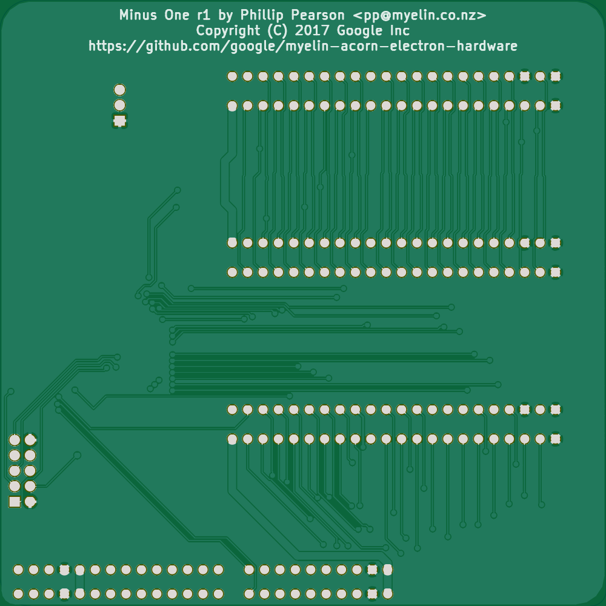

Minus One
=========

This is a simple Electron expansion that provides three cartridge
slots, with the same pinout as the cartridge slots on the Plus 1
(except for the nROMSTB line, which is unimplemented) using a CPLD for
address translation.

I made this after my Plus 1 broke, and it works very well in initial
testing.

Tested with:

- Acornsoft Hopper cartridge

- Dave Hitchins (Retro Hardware) Mega Games Cartridge

- My Elk PiTubeDirect cartridge

- My 32kb_flash_cartridge (original and standard)

[Discussion on the Stardot forums](http://stardot.org.uk/forums/viewtopic.php?f=3&t=13089).

