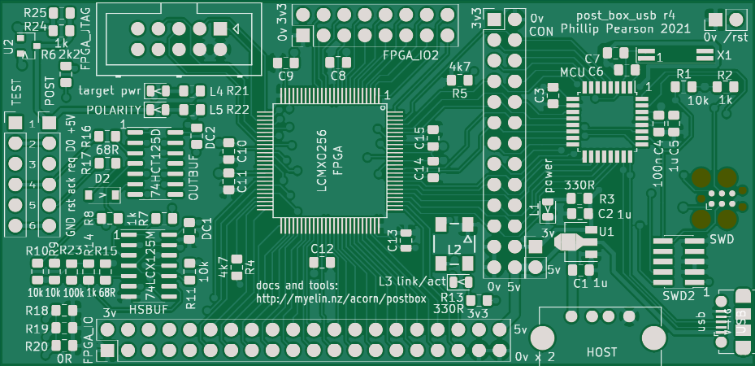

# post_box_usb

An adapter board to allow debugging Archimedes or Risc PC systems
using their POST headers.

[Stardot thread](https://stardot.org.uk/forums/viewtopic.php?f=16&t=17478)

Pictures
--------

