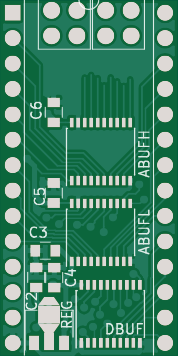
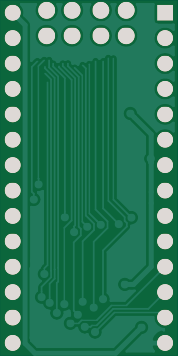

BBC Model B ROM socket level shifter
====================================

Level shifter to allow interfacing 3.3V FPGAs to a BBC ROM socket.  It
uses three 74LVC245 chips to buffer A0-13, /CS, /OE, and D0-7, and
brings out all of these plus the /CE signal for the data buffer to a
big messy 4x7 0.1" connector.

Untested.

r1 sent to Seeed 2017-12-06.

r2 adds a pullup resistor to /CE on the DBUF chip, and pin 1
indicators on the three buffers.

 
