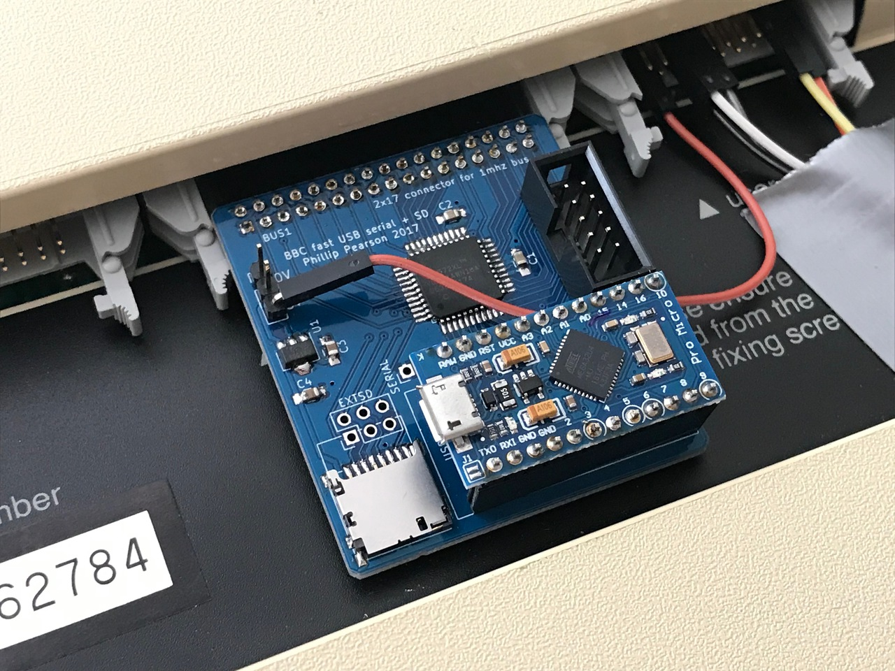
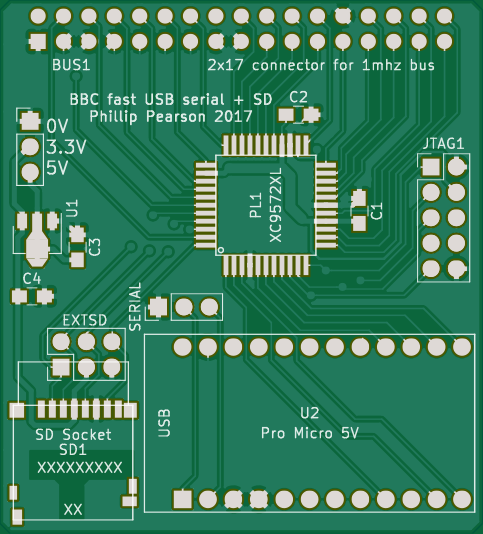
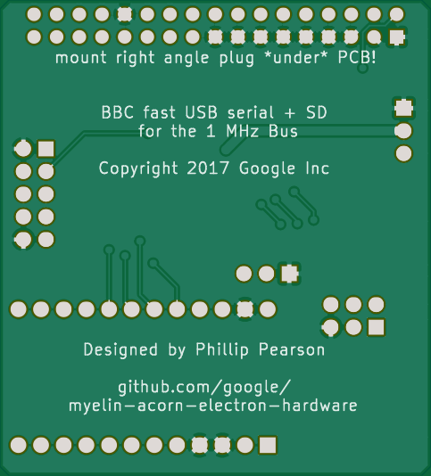

Fast serial port / SD card adapter
==================================

http://myelin.nz/acorn/bbcserial

This is something I'm working on to provide a fast serial port with
reliable flow control for a BBC or Electron.  On the BBC, it attaches
to the 1MHz bus, and on the Electron, it'll be a cartridge.

In both cases it consists of:

- a CPLD to communicate with the host machine's bus and share the SD
  card between the host machine and the Pro Micro.

- a Pro Micro (ATMEGA32U4) to provide a USB serial port, and in future act as a
  [HostFS](http://mdfs.net/Software/Tube/Serial/) server.

The next version will replace the Pro Micro with an ATSAMD11 or ATSAMD21, and
possibly add an ESP-WROOM-32 for wireless connectivity.

At present, it works well with a hacked-up version of J.G.Harston's HostFS,
running against sweh's TubeHost code on an attached laptop. This provides quite
a quick filing system that leaves PAGE=&E00 without requiring sideways RAM, as
all the buffers are in the host machine's memory.

I haven't tested this yet, but it should also work with the Electron Plus 1
build of [MMFS](https://github.com/hoglet67/MMFS).

I'm still figuring out if I can distribute HostFS or TubeHost as part
of this repository, but for the moment here's what you need to do:

- Download the
  [HostFS:UPURS source from sweh's site](https://www.spuddy.org/Beeb/UPURSFS/)
  (you want source.zip).

  - Unzip source.zip and edit hostfs.txt.  Replace &FE08 (TxStatus and RxStatus)
    with &FCA1, and replace &FE09 (TxData and RxData) with &FCA0.

  - Create the OBJ folder and run 'make OBJ/HOSTFS'.  This should build a HostFS
    ROM image in OBJ/HOSTFS.  You'll need [beebasm](http://www.retrosoftware.co.uk/wiki/index.php?title=BeebAsm)
    installed.

  - Load OBJ/HOSTFS into a spare sideways RAM bank, or program it into flash
    or EEPROM.

- Download [TubeHost from sweh's site](https://www.spuddy.org/Beeb/TubeHost/).

  - On macOS, run 'perl TubeHost -U /dev/tty.usb*'.  Linux will be similar but
    with a different path for the serial port.  On Windows/Cygwin you might be
    able to use 'perl TubeHost -U COMx'.

  - Hit BREAK on your Acorn machine and try listing the current directory,
    accessing files etc.  Let me know how it goes!

Electron version
----------------

This is the first one I tried, using a modified
[elk_pi_tube_direct](../elk_pi_tube_direct/) cartridge.  I haven't made a proper
PCB for it yet.

The CPLD design is in [cpld/](cpld/), and the MCU firmware is in
[serial_sd_mcu/](serial_sd_mcu/).

[Discussion on the Stardot forums](http://stardot.org.uk/forums/viewtopic.php?f=3&t=13292).

BBC version
-----------

The PCB is in [bbc_1mhz_bus_pcb/](bbc_1mhz_bus_pcb/) and the CPLD design is in
[bbc_1mhz_bus_cpld/](bbc_1mhz_bus_cpld/).  It uses the same MCU firmware as the
Electron version, from [serial_sd_mcu/](serial_sd_mcu/).

[Discussion on the Stardot forums](http://stardot.org.uk/forums/viewtopic.php?f=3&t=14033).

### Bill of materials

- 1 x XC9572XL-xxVQG44 (44-pin 0.8mm TQFP. Speed rating doesn't matter. I've
  been using Digikey part number 122-1448-ND, but that's out of stock right
  now, so 122-1981-ND is the next cheapest. Just search for XC9572XL VQG44 and
  anything there should be good.)
- 1 x 2x5 header for CPLD programming (Digikey ED1543-ND), or you can just use
  bare pin headers.
- 1 x MCP1700T-3302E/MB regulator (Digikey MCP1700T3302EMBCT-ND)
- 1 x right angle 2x17 female connector for the 1MHz bus (Digikey S5570-ND)
- 1 x micro SD socket (digikey HR1941CT-ND)
- 3 x 0805 100nF capacitors
- 2 x 0505 1uF capacitors
- 1 x Pro Micro board (from eBay/Aliexpress -- make sure you get the one that
  looks like the pic below, with the micro USB socket; I've seen another kind
  that doesn't include USB)
- 1 x 3-pin 0.1" spacing header for power
- 2 x 12-pin 0.1" spacing header + 2 x 12-pin 0.1" spacing receptacle for the
  Pro Micro

### Assembly notes

- Pin 1 of the CPLD is marked with a little bubble on the PCB; it's in the
  bottom left corner. There's a matching mark on the chip.
- Refer to the picture below for orientation for the JTAG header and Pro Micro.
- If you want to make the SD card easily accessible, solder on the 2x3 EXTSD
  header and run wires to an SD socket mounted somewhere else on your machine.
  If you want your SD card out of the way, solder on the micro SD socket
  (pictured below).
- You can either solder the Pro Micro right onto the board by soldering two
  12-pin headers onto the board, then dropping the Pro Micro on top and
  soldering it on, or you can make it removable by soldering the headers onto
  the underside of the Pro Micro board, and soldering two 12-pin receptacles
  onto the board. I have it set up this way because I'm experimenting with
  different microcontrollers, but it's safe to solder the Pro Micro directly
  onto the board if you prefer.

### Programming the Xilinx XC9572XL CPLD

Pre-built .jed and .svf files for the CPLD are checked in to the bbc_1mhz_serial_cpld/ folder,
so you don't need to install the Xilinx tools to program the CPLD.

If you're using a [simple_cpld_programmer](../simple_cpld_programmer) board, you
can program the CPLD like this:

    cd bbc_1mhz_serial_cpld
    make program

If you have an FTDI JTAG cable, you can program the CPLD like this:

    cd bbc_1mhz_serial_cpld
    make program-xc3sprog-ftdi

See [../notes/pld_programming_and_jtag.md](../notes/pld_programming_and_jtag.md)
for details on the JTAG pinout and on how to build a simple_cpld_programmer
board.

### Installed in a BBC B

### Renders of the BBC PCB

