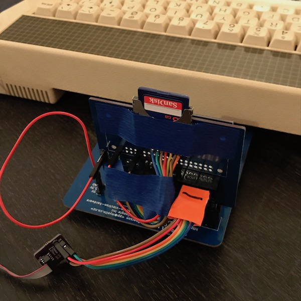

spi_sd_card
===========

This folder contains VHDL for an experimental SD card interface, that
implements the simple parallel port interface used by MMC_ElkPlus1.asm
in [MMFS](https://github.com/hoglet67/MMFS/).

It also contains an experimental version of the memory-mapped SPI port
as seen in MMC_MemoryMapped.asm, except at &FCD0 rather than &FE18.

Hardware-wise, right now it's an elk_pi_tube_direct cartridge with an
SD socket taped to the top, and jumper wires everywhere.  It draws
power from the minus_one's 3.3V pin.

Connections (with wire colours for my convenience):

- tube_D<5> - blue, nSS
- tube_D<6> - green, MOSI
- tube_D<7> - yellow, SCK
- tube_D<0> - orange, MISO

On SD card:

- 9 (notch) - DAT2
- 1 - DAT3/nSS (blue)
- 2 - CMD/MOSI (green)
- 3 - GND (brown)
- 4 - 3.3V (red)
- 5 - CLK/SCK (yellow)
- 6 - GND (brown)
- 7 - DAT0/MISO (orange)
- 8 - DAT1

The next step here is to attempt to implement a memory-mapped serial
port using tube_A1 and tube_A2 (soldered as the leftmost two yellow
pins on my board).  Starting out by just emulating the Elk User Port,
at FCB3 (upddrb) and FCB1 (upiob), which will bit bang and absolve the
CPLD from having to deal with timing...

- GND from 0V pin
- Pro Micro RXD (white) = CPLD TXD = tube_A1 (leftmost yellow pin, next to +3V3)
- Pro Micro TXD (grey) = CPLD RXD = tube_A2
- Pro Micro CTS/pin 4 (orange) = CPLD RTS = tube_nRST

EUPURS manual says do this to get CTS:
?&FCB3 = &7D
?&FCB1 = &40
And to clear CTS:
?&FCB1 = 0
It looks like &FCB3 is DDRA and &FCB1 is IOA.
The BBC cable has
	TXD = pin 20, PB7
	CTS = pin 18, PB6
	RTS = pin 8, PB1
	RXD = pin 6, PB0
Elk card has the following connection for the 9-pin DIN:
	PA7 = pin 3 via 4k7 (TXD)
	PA6 = pin 8 (CTS)
	PA1 = pin 7 via 4k7 (RTS)
	PA0 = pin 2 (RXD)
DDR = &7D = b'01111101, with 0=input, so PA7 (TXD) and PA1 (RTS) are inputs,
and PA6 (CTS) and PA0 (RXD) are outputs.  This is a bit confusing but it looks
like we're using the pin naming on the PC side, so "TXD" is an input.  I would
normally say PA7=RXD (in), PA6=RTS, PA1=CTS (in), PA0=TXD.

6502 read &FCB1: RXD 11111 CTS 1 (and CTS is never read so that can read as '1')
6502 write FCB1: x RTS xxxxx TXD

CA1 and CA2 are *not* connected, so maybe this means that EUPURS just bit bangs everything???

seem to mainly either write &40 or &00 to IOA.
&40 = 0100 0000 = RTS=1 (send)
&00 = RTS=0 (don't send)

[Discussion on the Stardot forums](http://www.stardot.org.uk/forums/viewtopic.php?f=3&t=12737&start=30#p170599).

