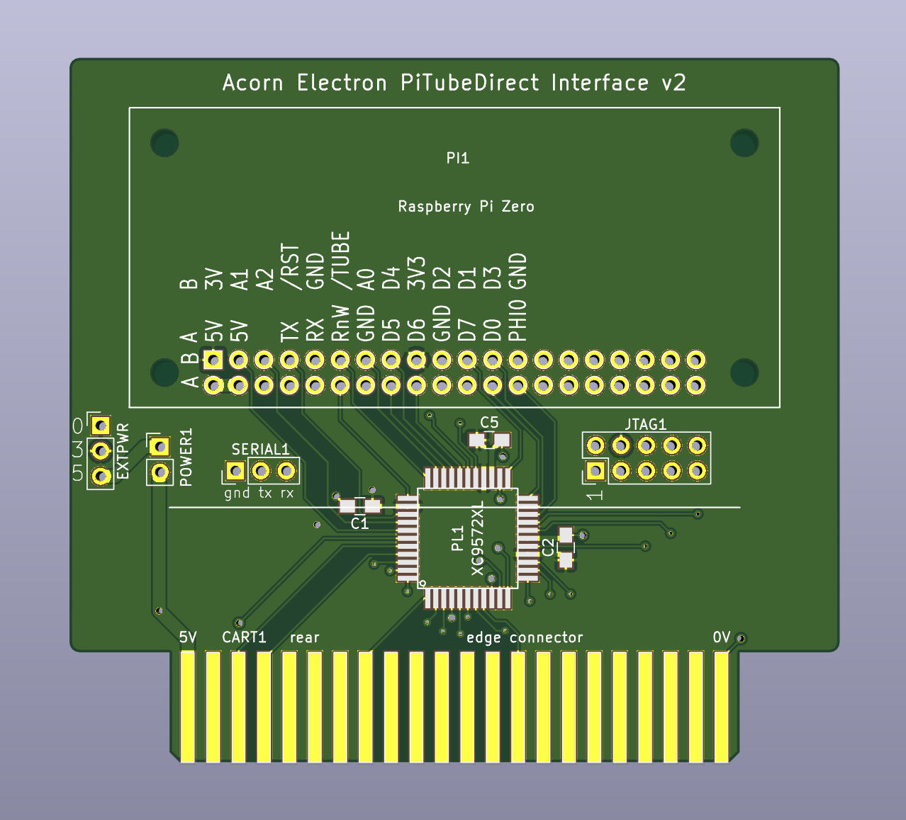

spi_sd_card
===========

This folder contains VHDL for an experimental SD card interface for the Electron.  It
implements the Plus 1 printer port interface used by MMC_ElkPlus1.asm
in [MMFS](https://github.com/hoglet67/MMFS/) at &FCC1 (data) and &FCC2 (status), and the bit-banged serial port used by EUP/EUPURS, at &FCB1.

It also contains an experimental version of the memory-mapped SPI port
as seen in MMC_MemoryMapped.asm, except at &FCD0 rather than &FE18.

[Discussion on the Stardot forums](http://www.stardot.org.uk/forums/viewtopic.php?f=3&t=12737&start=30#p170599).

*For a related design which implements a USB serial port as well as the
bit-banged printer port SD card interface used here, and connects to the BBC Micro's 1MHz Bus, see
the [serial_sd_adapter](../serial_sd_adapter) project.*

The first prototype (pictured above) was an [elk_pi_tube_direct](../elk_pi_tube_direct) cartridge with an
SD socket taped to the top, and jumper wires everywhere, drawing
power from the minus_one's 3.3V pin.

The second prototype is an elk_pi_tube_direct cartridge hooked up to an Arduino SD card adapter from eBay, which provides the 3.3V power.

How to build one
----------------

You'll need the following:

- A way to load the MMFS ROM on your machine: a flash or EPROM cartridge, an ABR, or some sideways RAM and a way to load it.  I use one of my [32k flash cartridges](../32kb_flash_cartridge), programmed using the [USB cartridge interface](../standalone_cartridge_programmer).

- One of my [elk_pi_tube_direct](../elk_pi_tube_direct) boards.

- A suitable SD card adapter that includes a 3.3V regulator and connections for both 5V and 3.3V, for example [Adafruit's microSD breakout board](https://www.adafruit.com/product/254), or [this Arduino SD module from eBay](https://www.ebay.com/itm/2PCS-Read-And-Write-For-Arduino-ARM-MCU-SD-Card-Module-Slot-Socket-Reader-N150/401299905512).

Assembly instructions:

- Double check that your SD card adapter has connections for both 5V and 3.3V.  The 3.3V line will power the CPLD on the cartridge board, so adapters which only have a 5V input will not work.

- Solder the board up as described in the link above, except solder 0.1" male header to the Raspberry Pi socket instead of the female header that you would use to connect to a Raspberry Pi.

- Connect the board to the SD adapter using jumper ("Dupont") wires as follows.  Note that different SD adapters label their pins differently; the Adafruit board uses CS/DI/CLK/DO, whereas the eBay one uses CS/MOSI/SCK/MISO.

  - GND - GND
  - 3V3 - 3V3
  - 5V - 5V
  - D5 - DAT3 / CS
  - D6 - CMD / MOSI / DI
  - D7 - CLK / SCK
  - D0 - DAT0 / MISO / DO

Programming the CPLD
--------------------

There are two CPLD builds (spi_sd_card-xc9536xl-10-VQ44.svf and spi_sd_card-xc9572xl-10-VQ44.svf); pick the correct one for the chip you have soldered onto your board.

[Here are some notes on how to program a Xilinx CPLD](../notes/pld_programming_and_jtag.md).

TODO document this better.

Building MMFS
-------------

The standard Electron MMFS build uses &FC71 for data and &FC72 for status, except those are owned by the Plus 1, so this board uses a different pair of addresses (&FCC1/&FCC2). This means you need a modified MMFS ROM.

TODO document this.

Using the serial port and EUPURS
--------------------------------

TODO document this.

Development notes
=================

Serial port
-----------

The next step here is to attempt to implement a memory-mapped serial
port using tube_A1 and tube_A2 (soldered as the leftmost two yellow
pins on my board).  Starting out by just emulating the Elk User Port,
at FCB3 (upddrb) and FCB1 (upiob), which will bit bang and allow us to use UPURS, which absolves the
CPLD from having to deal with timing.

- GND from 0V pin (green)
- Pro Micro TXD (orange) = CPLD RXD = tube_A2
- Pro Micro CTS/pin 4 (blue) = CPLD RTS = tube_nRST
- Pro Micro RXD/pin 8 (yellow) = CPLD TXD = tube_A1 (leftmost yellow pin, next to +3V3)

Serial port debug notes
-----------------------

These are a bit cryptic and can be ignored -- they're notes from when I was
getting UPURS running properly with the board.

[The UPURS manual](https://www.retro-kit.co.uk/UPURS/) will help you make sense
of this :)

UPURS manual says do this to get CTS:

~~~~
?&FCB3 = &7D
?&FCB1 = &40
~~~~

And to clear CTS:

~~~~
?&FCB1 = 0
~~~~

It looks like &FCB3 is DDRA and &FCB1 is IOA on the 6522.

The official BBC cable for UPURS (documented in the manual) has:
- TXD = pin 20, PB7
- CTS = pin 18, PB6
- RTS = pin 8, PB1
- RXD = pin 6, PB0

[The Elk User Port
card](https://www.retro-kit.co.uk/page.cfm/content/Electron-User-Port-and-ROMRAM-board/)
has the following connection for the 9-pin DIN:

- PA7 = pin 3 via 4k7 (TXD)
- PA6 = pin 8 (CTS)
- PA1 = pin 7 via 4k7 (RTS)
- PA0 = pin 2 (RXD)

DDR = &7D = b'01111101, with 0=input, so PA7 (TXD) and PA1 (RTS) are inputs, and
PA6 (CTS) and PA0 (RXD) are outputs.  It looks like we're using the pin naming
on the PC side, so "TXD" is an input.  The Electron-centric naming would be
PA7=RXD (in), PA6=RTS, PA1=CTS (in), PA0=TXD.

6502 read &FCB1: RXD 11111 CTS 1 (and CTS is never read so that can read as '1')
6502 write FCB1: x RTS xxxxx TXD

CA1 and CA2 are *not* connected, because UPURS bit bangs the serial signal.

It controls RTS by writing &40 or &00 to IOA:
- &40 = 0100 0000 = RTS=1 (send)
- &00 = RTS=0 (don't send)

I was running into quite a few bit errors when connecting this up to a
microcontroller's serial port.  The eventual solution was just to tweak the
serial speed on the MCU, because it wasn't spot on 115200 bps.

UPURS bit error debugging: finally managed to catch an example of this in Saleae.

c -> 3
c '0b01100011'
3 '0b00110011'

Looks like if UPURS is slightly late catching the start bit, it's just barely too slow later on.
The AVR is running at just over 117kbit.  Try slowing down slightly?

- uint16_t baud_setting = (F_CPU / 4 / baud - 1) / 2;
- = (16M / 4 / baud - 1) / 2
- = 16
- so 16 * 2 + 1 = 4M / baud
- baud = 4M / (16 * 2 + 1) = 121212
- what's the next slowest?  17?
- 4M / (17 * 2 + 1) = 117647 -- looks like that's actually what we're using.
- Next one down is 111111; let's try that.

Details on catching the start bit:
- The ULA seems to be stretching the high clock period to 1.25us every time UPURS accesses
  &FCB1.  1MHz bus emulation, perhaps?
- Acorn poll: 1.24us high, 2.76us low = total 4us (8 clocks?)
- From falling edge of last detection to falling edge of write to set CTS is 9us
- Then 3us to falling edge of read for bit 0
- bit 0-1 7.76 + 1.24 (9us)
- 1-2 7.78 + 1.24 (9us)
- 2-3 6.78 + 1.24 (8us)
- 3-4 7.76 + 1.24 (9us)
- 4-5 6.76 + 1.24 (8us)
- 5-6 7.76 + 1.24 (9us)
- 6-7 6.76 + 1.24 (8us)
The AVR has an 8.5 us bit time (117647 bps).  Next step down is 111111 (9 us).

Looking good if I remove a NOP between bit 0-1 and run with the AVR set to 115200!

Thinking through the bit timings.  115200 = 8.68 us per bit. Found one more NOP
to move and sent Martin an email. Eventually figured out I could get the same
results by tweaking the serial rate on the MCU.

When running sweh's HostFS:UPURS (UPURSFS):
- ./TubeHost -U /dev/tty.usb*
