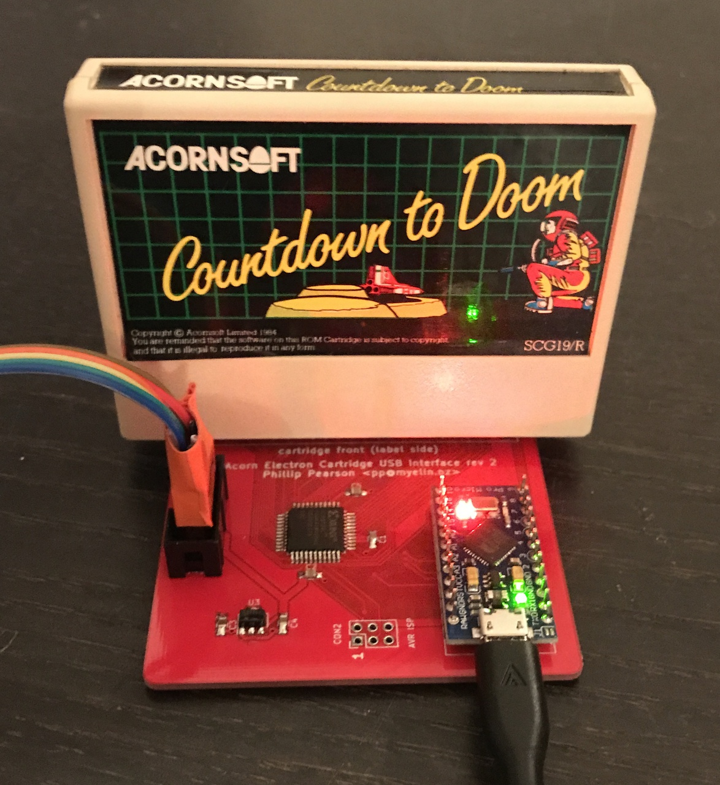
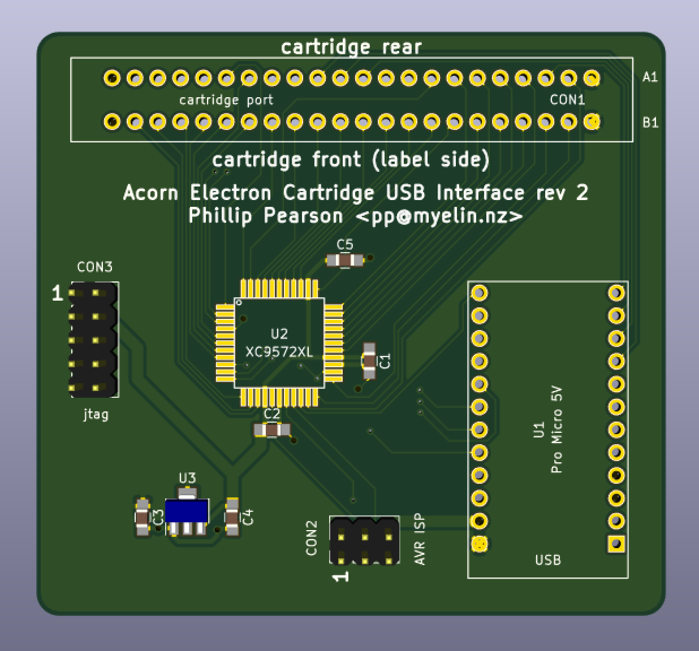
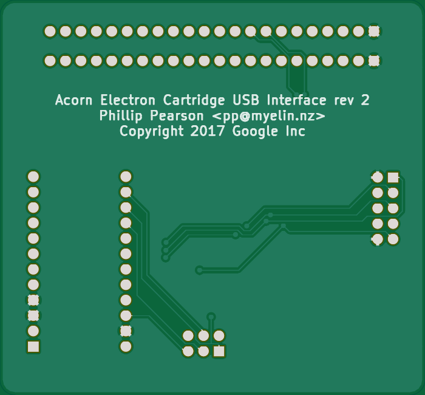

standalone_cartridge_programmer
===============================

This folder contains the PCB design, HDL, and firmware for a board
that allows access to an Acorn Electron cartridge over USB.

I've built one of these boards and implemented the read path, so it can dump out
the contents of a ROM cartridge.  I've also implemented /INFC and /INFD page
access, and successfully downloaded ROM images from a Mega Games Cartridge.

[pcb/](pcb/) - PCB design

[cpld/](cpld/) - HDL for the on-board CPLD (use Xilinx ISE and
xc3sprog)

[mcu/](mcu/) - Firmware for the Pro Micro (use the Arduino IDE,
selecting the Arduino Leonardo board option)

[Discussion on the Stardot forums](http://stardot.org.uk/forums/viewtopic.php?f=3&t=12964).

