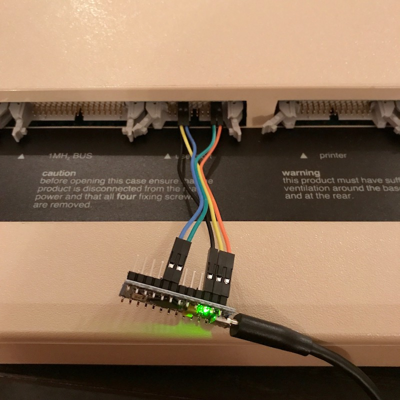

This is an Arduino sketch, to be run on a Pro Micro (ATMEGA32U4)
board, that turns it into a USB serial adapter for Martin Barr's
UPURS.

It works very well with UPURS.  I couldn't get it to work reliably
with [UPURSFS (HostFS:UPURS)](https://www.retro-kit.co.uk/UPURS/); I
suspect there are bugs in my code to calculate when it's safe to send
a byte.

*TODO*: Investigate this more.  8bitkick has apparently got it working
reliably on an Arduino MKR1000, which uses an ATSAMD21 core at 48MHz.
I'd like to have it running rock-solid on an ATMEGA32U4, because no
level shifting is required, and keeping the component count to a
minimum is very much in line with the UPURS philosophy.

[Discussion on the Stardot forums](http://www.stardot.org.uk/forums/viewtopic.php?f=3&t=13299).

